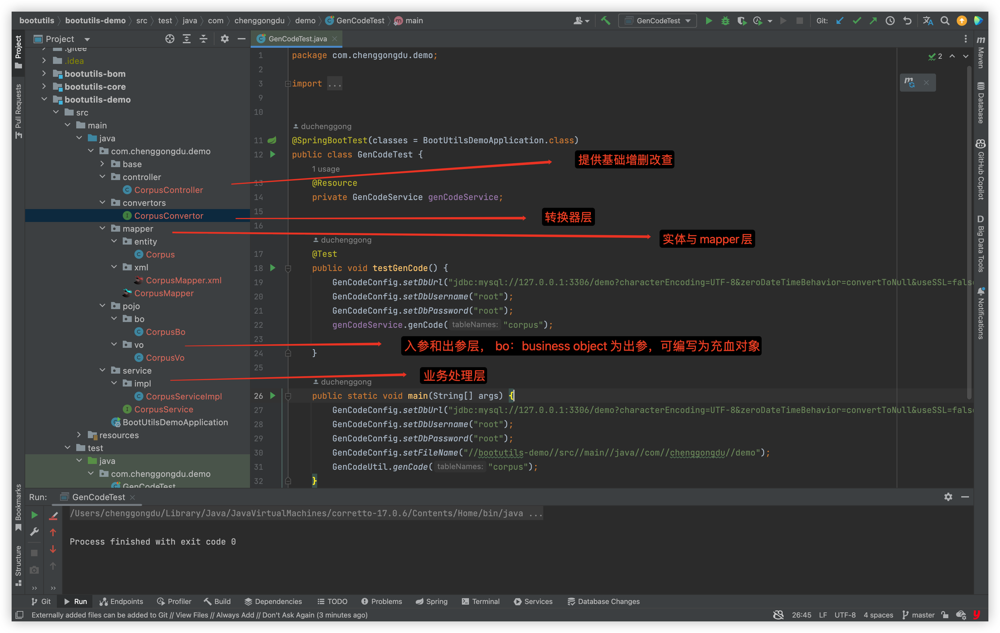

# bootutils

#### 介绍

基于springboot3的便捷开发工具

#### 软件架构

springboot 3.13 hutool 5.8.21

#### 快速开始

- 通过import方式

```xml
<dependencyManagement>
    <dependencies>
        <dependency>
            <groupId>com.chenggongdu</groupId>
            <artifactId>bootutils-bom</artifactId>
            <version>1.0.0</version>
            <type>pom</type>
            <scope>import</scope>
        </dependency>
    </dependencies>
</dependencyManagement>
```

在子模块中就可以引入自己需要的模块了：

```xml
<dependency>
    <groupId>com.chenggongdu</groupId>
    <artifactId>bootutils-gencode</artifactId>
    <scope>test</scope>
</dependency>
```
- 通过dependency直接引入
```xml
<dependency>
    <groupId>com.chenggongdu</groupId>
    <artifactId>bootutils-gencode</artifactId>
    <scope>test</scope>
    <version>1.0.0</version>
</dependency>
```
#### 使用说明

##### 代码生成
面向单一原则的代码生成，依赖springboot3 和 openapi3

- 如何快速测试
1. git clone https://github.com/chenggongdu/bootutils.git
2. bootutils-demo有快速使用例子，代码的生成的参考com.chenggongdu.demo.GenCodeTest
- 生成目录结构说明
  
    

#### 参与贡献
欢迎小伙伴提交issue和pr

[github]https://github.com/chenggongdu/bootutils
[gitee]https://gitee.com/Edon-Du/bootutils

